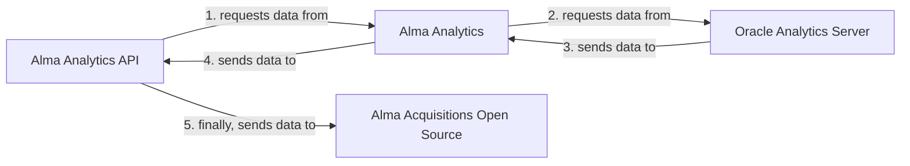
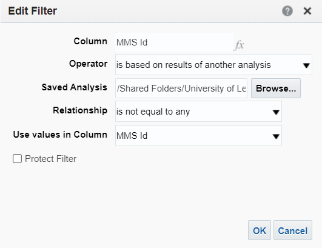
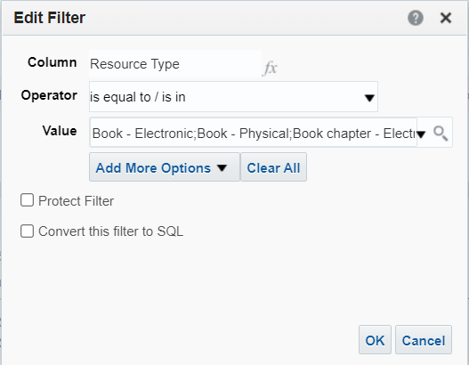
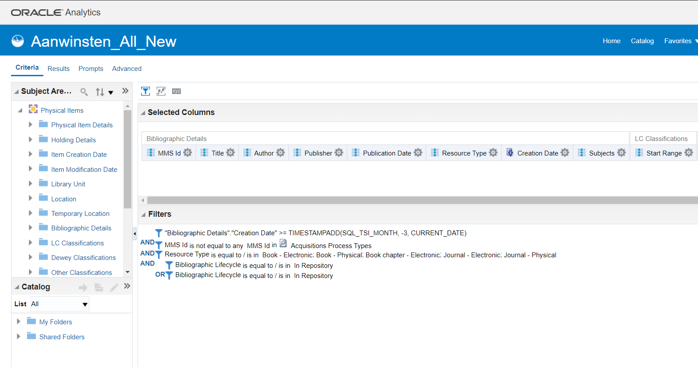
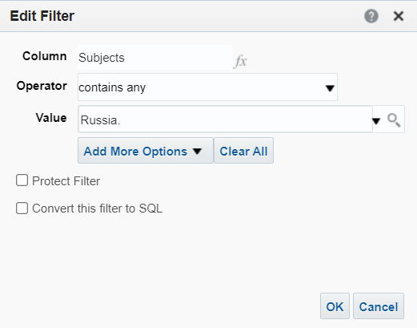

Alma Acquisitions (Open Source) requires data to be generated in Alma Analytics first. This data will then be requested via the Alma Analytics API and finally imported into the application.



!!! Important
      **Before attempting to run this application and importing data, you must make sure that your Alma Analytics data configuration is properly setup.**

!!! Note
      Alma Analytics refreshes its data only once a day, furthermore it is build on top of Oracle Analytics Server (OAS)[^1]. For performance and usability reasons, this application stores and consumes data from a database, rather than relying on *on-the-fly* requests via the Alma Analytics API.

## Creating a 'Latest Acquisitions' query in Alma Analytics

!!! Important
      Alma Acquisitions (Open Source) expects **exactly** the following columns. You can use other columns, but you will have to edit the views in `resources\views` and the JavaScript in `public_html\js\datatable.js` to accommodate your customizations.

In Alma Analytics, create a new 'Analysis'. In the 'Criteria' tab, add the following columns:

(Bibliographic Details)  

* MMS Id  
* Title  
* Author  
* Publisher  
* Publication Date  
* Resource Type  
* Creation Date  
* Subjects

(LC Classifications)  

* Start Range

As 'Filters', add the following:

* (Advanced SQL Filter) ```"Bibliographic Details"."Creation Date" >= TIMESTAMPADD(SQL_TSI_MONTH, -6, CURRENT_DATE)```[^2]  
  { loading=lazy }
**AND**
* ```MMS Id is not equal to any  MMS Id in Acquisitions Process Types```[^3]  
  { loading=lazy }
**AND**
* ```Resource Type is equal to / is in  Book - Electronic; Book - Physical; Book chapter - Electronic; Journal - Electronic; Journal - Physical```[^4]
  { loading=lazy }
**AND**
* (Physical Items)```Bibliographic Lifecycle is equal to / is in  In Repository```[^5]  
   **OR**
  * (E-Inventory)```Bibliographic Lifecycle is equal to / is in  In Repository```[^6]

Your criteria should look like this:
{ loading=lazy }

## Creating an acquisitions list for a specific subject in Alma Analytics

To create an acquisitions list that includes items from a specific subject, start by following the steps in the [previous chapter](alma-analytics.md#creating-an-latest-acquisitions-query-in-alma-analytics). In the 'Criteria' tab, add a new **AND** to your filters and choose any filter that may fit your case. For example, if you are creating a acquisitions list for *Russian Studies*, you might want to add a filter like:
```Subjects contains any Russia.```  

{ loading=lazy }

You can add as many filters as you need.

!!! Tip
      At Leiden University Libraries, the filters for a specific acquisitions list are defined by the Subject Specialist and implemented in Alma Analytics by one of the Alma System Managers.

[^1]: ExLibris <2022> [Introduction to Analytics and Terminology](https://knowledge.exlibrisgroup.com/Alma/Product_Documentation/010Alma_Online_Help_(English)/080Analytics/010Introduction). (Accessed: 1 June 2022)
[^2]: ```SQL_TSI_MONTH, -6, CURRENT_DATE``` will collect all the acquisitions in the previous 6 months from the current date. You can edit the amount to fit your needs.
[^3]: ```MMS Id is not equal to any  MMS Id in Acquisitions Process Types``` filters items that are not yet available to the library users.
[^4]: ```Resource Type is equal to / is in  Book - Electronic; Book - Physical; Book chapter - Electronic; Journal - Electronic; Journal - Physical``` are the type of materials we want to show our users.
[^5]: (Physical Items)```Bibliographic Lifecycle is equal to / is in  In Repository``` and (E-Inventory)```Bibliographic Lifecycle is equal to / is in  In Repository``` prevent displaying empty records to the end users.
